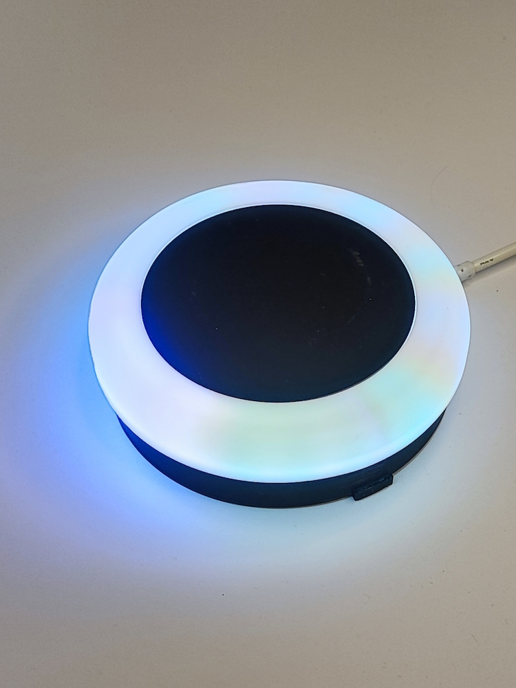

<!--Описание устройства-->
Программное обеспечение для микроконтроллера подставки

<!--Блок информации о репозитории в бейджах-->

## Установка обновления прошивки в подставку

В ближайшее время появится видео

<!--Совместимость -->
## Совместимость железа, прошивки и приложения

| (HW) Подставка железо   | (HEX) Подставка прошивка  | (APK) Андроид приложение  |
|-------------------------|---------------------------|---------------------------|
| 1.1                     | 1.0.0                     | 1.0.0                     |
| 1.3                     | 1.1.0 - 1.25.0            | 1.1.0 - 1.4.2             |
| 1.3                     | 1.26.0                    | 1.4.3                     |
| 1.4                     |                           |                           |

<!--Релиз железа/корпуса -->
## HW - Релизы железа/корпуса
История изменений [здесь](./1_HW/CHANGELOG_HW.md).

<!--Релиз прошивки -->
## HEX - Релизы прошивки
История изменений [здесь](./2_HEX/CHANGELOG_HEX.md).

<!--Релиз дизайна -->
## DES - Релизы дизайна
История изменений [здесь](./3_DES/CHANGELOG_DES.md).

<!--Android приложение-->
## APK - Установить Android приложение
История изменений [здесь](./4_APK/CHANGELOG_APK.md).

<!--Поддержка-->
## Поддержка
Если у вас возникли сложности или вопросы по использованию пакета, создайте 
[обсуждение](https://github.com/USKUdev/avtobarmen_coaster/issues/new/choose) в данном репозитории.

<!--зависимости-->
## Зависимости
Эта программа зависит от установленных модулей и датчиков внутри устройства. Если вы заметили, что он не работает на какой-либо версии, то напишите в [поддержку](https://github.com/USKUdev/avtobarmen_coaster#поддержка)
